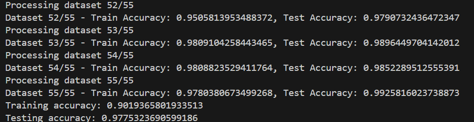
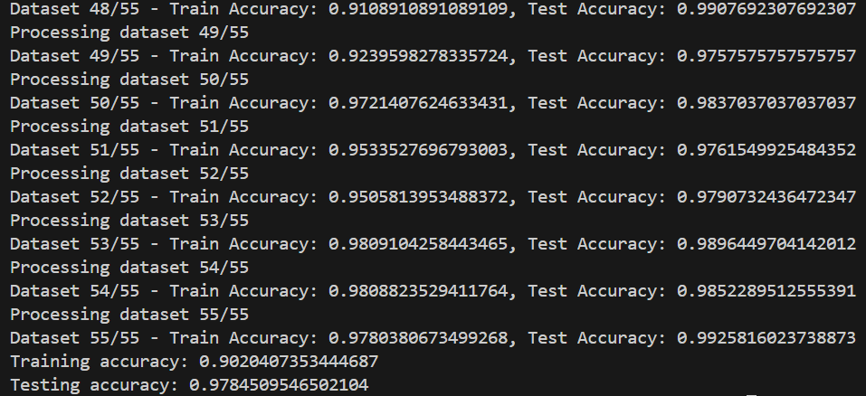
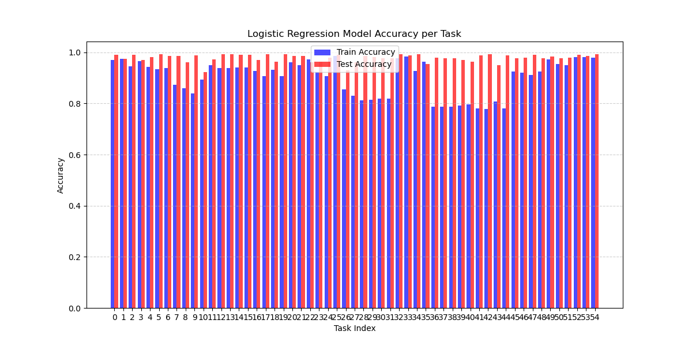

### **LR Protein Classification 实验报告**  

---

#### **1. 实验目标**  
本实验的目标是使用 **逻辑回归（Logistic Regression, LR）** 进行蛋白质分类，并对比两种不同的实现方式在分类任务上的表现：  
1. **LRModel**: 使用现有的机器学习库（如`sklearn`）实现的逻辑回归分类。  
2. **LRMFromScratch**: 通过手写代码从零实现逻辑回归，并进行相同的分类任务。  

---

#### **2. 实验结果分析**  

##### **2.1 平均准确率对比**  
实验在 **55 个不同的数据集** 上进行了训练和测试，最终的 **平均准确率** 如下：  

| 模型 | 训练集准确率 | 测试集准确率 |
|------|------------|------------|
| **LRModel** | 90.19% | 97.75% |
| **LRMFromScratch** | 90.20% | 97.85% |

从结果可以看出：
- **两种方法的整体准确率相当**，表明手写逻辑回归（LRMFromScratch）与库实现的逻辑回归（LRModel）在整体性能上基本一致。  
- **训练集准确率 90% 左右**，表明模型在训练集上的拟合情况较好。  
- **测试集准确率 97% 以上**，高于训练集，可能是训练集包含一定噪声，影响了训练时的学习效果。  

下图展示了 LRModel 和 LRMFromScratch 在训练集与测试集上的平均准确率：  

  

LRModel 的平均 Accuracy : 0.9019 / 0.9775

  

  

LRMFromScratch 的平均 Accuracy : 0.9020 / 0.9785

  

---

##### **2.2 任务级别准确率分析**  
为了进一步分析模型的表现，我们绘制了 **每个数据集（task）的分类准确率**，如下图所示：  

  

LRModel 每个 task 的 Accuracy

  

  

LRMFromScratch 每个 task 的 Accuracy

  

从图中可以看出：
- **部分数据集的准确率接近 100%**，说明这些数据集可能较容易分类。  
- **在 Dataset 27、Dataset 37-41 等数据集上，准确率下降（约 78%-85%）**，说明这些数据集对模型提出了更大的挑战，可能的原因包括：
  - 类别分布不均衡，导致模型在某些类别上的表现较差。  
  - 数据集存在一定的噪声，影响了模型的学习效果。  
  - 逻辑回归模型的**线性假设**可能不完全适用于某些数据集的特征分布。  

---

#### **3. 可能的优化方向**  
针对实验结果，我们可以从以下几个方面进行优化：  

1. **提高训练集准确率**：
   - 适当调整 **学习率**，避免收敛过快或过慢。  
   - 采用 **L2 正则化** 控制模型复杂度，减少过拟合风险。  
   - 使用 **更多数据** 或 **数据增强**，提高模型的泛化能力。  

2. **提升低准确率数据集的分类效果**：
   - 采用 **分层采样**，确保训练集中不同类别数据的均衡分布。  
   - 重新检查 **数据预处理步骤**，确保特征工程合理性。  
   - **尝试更复杂的模型**（如 SVM、神经网络），应对复杂特征分布。  

---

#### **4. 结论**  
本次实验验证了 **逻辑回归在蛋白质分类任务中的可行性**，并对比了 **手写逻辑回归** 和 **库实现的逻辑回归**，得出以下结论：  
- **两者的整体准确率相当**，表明手写实现能够较好地复现逻辑回归的功能。  
- **部分数据集上表现不稳定**，可能受到类别分布和数据质量的影响。  
- **优化方向** 主要集中在 **调整学习率、使用正则化、提升数据质量** 等方面。  